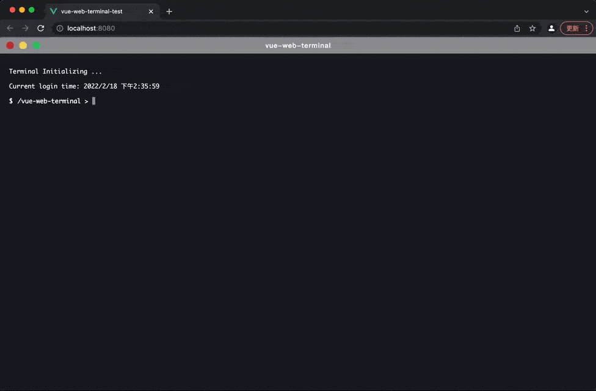

中文版 | [English](./README.md)

<div align=center>

</div>

# vue-web-terminal

<a href="https://github.com/tzfun/vue-web-terminal/tree/vue2"></a>
<a href="https://github.com/tzfun/vue-web-terminal/tree/vue3"></a>
<a href="https://www.npmjs.com/package/vue-web-terminal"></a>
<a href="https://npmcharts.com/compare/vue-web-terminal?minimal=true"></a>
<a href="https://www.npmjs.com/package/vue-web-terminal"></a>

一个由 Vue 构建的支持多内容格式显示的网页端命令行窗口插件，支持表格、json、代码等多种消息格式，支持自定义消息样式、命令行库、键入搜索提示等，模拟原生终端窗口支持 ← →
光标切换和 ↑ ↓ 历史命令切换。

> :tada: 新版文档已开放访问，文档更详细界面更友好，欢迎体验：[https://tzfun.github.io/vue-web-terminal/](https://tzfun.github.io/vue-web-terminal/)

## 功能支持

* 支持消息格式：普通文本、表格、json、代码/多行文本、html、ansi
* 支持内容实时回显、追加，可制作简单的动画效果
* 支持用户问答输入
* 支持在线文本编辑
* 支持Highlight、Codemirror代码高亮
* 支持窗口拖拽、固定
* 支持 ← → 光标键切换和 ↑ ↓ 键历史命令切换
* 支持一键全屏
* 支持命令输入提示
* 支持日志记录分组折叠
* 支持多种样式 Slot 插槽，可自定义样式
* 支持主题，默认内置暗色和亮色主题，也可自定义主题
* 提供丰富的JS API，几乎所有功能均可由API来模拟非人为操作
* 支持Vue2/Vue3



> 一句话描述：
>
> 它并不具备执行某个具体命令的能力，这个能力需要开发者自己去实现，它负责的事情是在网页上以终端界面的形式从用户那拿到想要执行的命令，然后交给开发者去实现，执行完之后再交给它展示给用户。

# 在线体验

你可以通过 [在线体验](https://tzfun.github.io/vue-web-terminal/demo.html) 了解本插件的一些功能，也可以在 [](https://codesandbox.io/s/silly-scooby-l8wk9b) 上尝试编辑代码并预览。

# 文档

请前往 [Document](https://tzfun.github.io/vue-web-terminal/) 阅读使用文档

# 快速上手

> **Vue2**版本从 **2024年12月24日** 开始正式归档，不再提供维护更新，
> 源码见 [vue2分支](https://github.com/tzfun/vue-web-terminal/tree/vue2)。

npm安装vue-web-terminal，`2.x.x`版本对应vue2，`3.x.x`版本对应vue3，建议下载对应大版本的最新版。

```shell
#  install for vue2
npm install vue-web-terminal@2.xx --save

#  install for vue3
npm install vue-web-terminal@3.xx --save 
```

main.js中载入 Terminal 插件

```js
import Terminal from 'vue-web-terminal'

// for vue2
Vue.use(Terminal)

// for vue3
const app = createApp(App).use(Terminal)
```

使用示例

```vue
<script setup>
  import Terminal from "vue-web-terminal"
  const onExecCmd = (key, command, success, failed) => {
    if (key === 'fail') {
      failed('Something wrong!!!')
    } else {
      let allClass = ['success', 'error', 'system', 'info', 'warning'];

      let clazz = allClass[Math.floor(Math.random() * allClass.length)];
      success({
        type: 'normal',
        class: clazz,
        tag: 'success',
        content: command
      })
    }
  }
</script>
<template>
  <div id="app">
    <terminal name="my-terminal" @exec-cmd="onExecCmd"></terminal>
  </div>
</template>

<style>
  body, html, #app {
    margin: 0;
    padding: 0;
    width: 100%;
    height: 100%;
  }
</style>
```

# 联系作者

我是一名后端Coder，恰巧对前端也会一点，个人兴趣开发了此插件。

如果对代码优化或功能有好的想法并乐意贡献代码欢迎提交[PR](https://github.com/tzfun/vue-web-terminal/pulls)
，对插件使用存在疑问或发现bug请提交[issue](https://github.com/tzfun/vue-web-terminal/issues)。

> 联系我（添加请备注vue-web-terminal）
>
> 📮 Email: *beifengtz@qq.com*
>
>  微信: *beifeng-tz*

# License

[Apache License 2.0](LICENSE)
